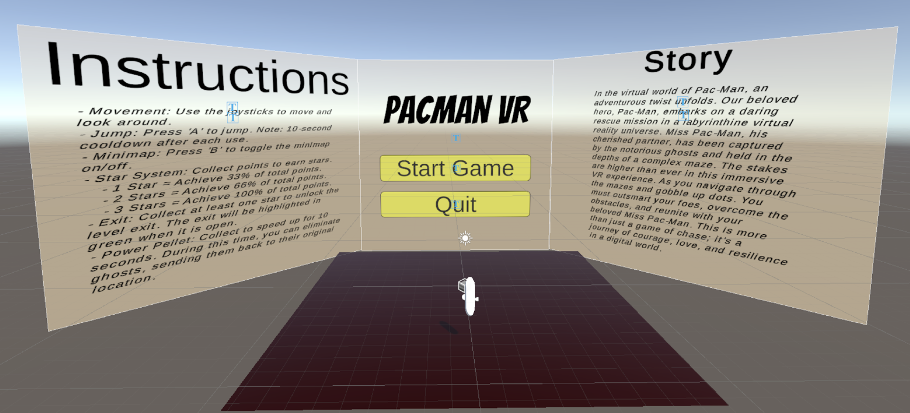
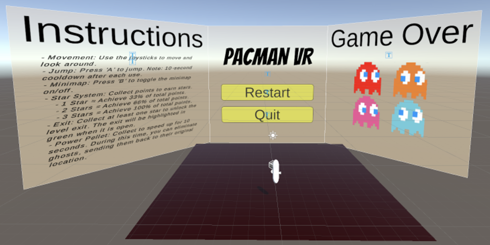
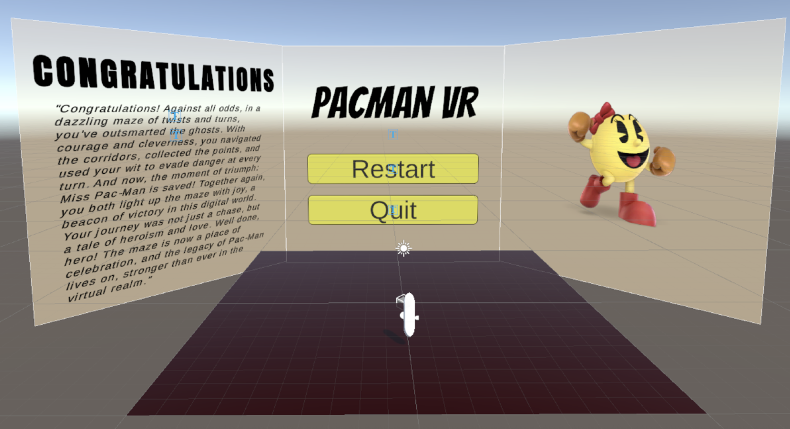
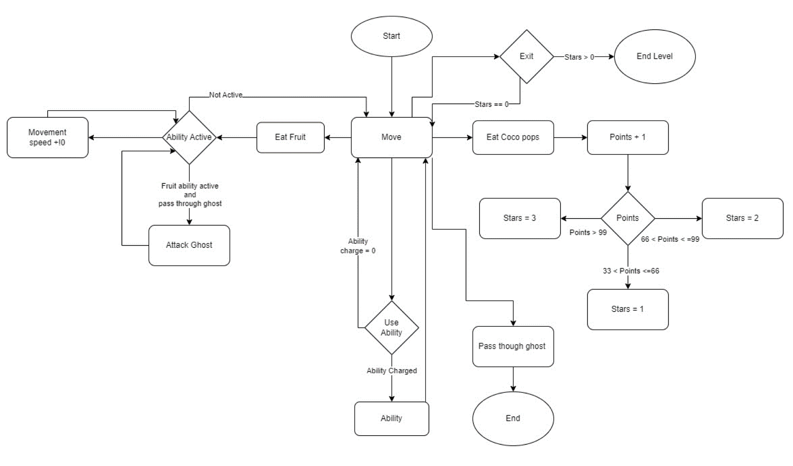

# 🕹 AI-Enhanced VR Pac-Man Experience

A cutting-edge VR reimagining of the classic Pac-Man game, built in **Unity** with **C# scripting**, **AI-powered ghost behavior**, and immersive **Virtual Reality controls**. This project demonstrates the integration of **game design**, **AI programming**, and **VR optimization techniques** to deliver a polished, professional-grade experience.  

---

## 📌 Project Overview  

This project’s primary goal was to combine **classic arcade nostalgia** with **modern VR technology** and **AI-driven gameplay**. We set out to create an **immersive, dynamic environment** where player actions directly influence enemy AI states.  

The result is a **two-level VR Pac-Man** where the ghosts are powered by **state machine AI**, the environment is built for **360° interaction**, and VR-specific optimizations ensure comfort and responsiveness.  

---

## 🧠 AI Implementation  

The **Ghost AI** is implemented using the **State Design Pattern**, making it modular, scalable, and easy to modify.  

Ghost states include:  
- **Chase State** – Ghost actively pursues the player using adaptive pathfinding.  
- **Scatter State** – Ghosts retreat to maze corners, creating strategic breathing space for the player.  
- **Frightened State** – Triggered by player power-ups; ghosts avoid the player.  
- **Idle State** – Ghosts remain passive until triggered by gameplay events.  

AI decisions are based on **real-time player position tracking**, **event triggers**, and **timed transitions**.  

---

## 🛠 Technology & Tools  

- **Engine:** Unity  
- **Language:** C#  
- **VR Framework:** Unity XR Toolkit  
- **AI:** State Design Pattern for Ghost Behavior  
- **3D Assets:** Custom-created models & textures  
- **Optimization:** Static batching, texture compression, VR framerate tuning  
- **Sensors:** VR headset position & rotation tracking, motion controllers  

---

## 🎯 Features  

- **Two Distinct Levels** – Level 1 is a bright, classic maze; Level 2 is a dark, high-stakes challenge.  
- **Immersive VR Interaction** – Smooth locomotion, head tracking, and hand-based controls.  
- **Adaptive AI Difficulty** – Ghost behavior adjusts dynamically.  
- **Win/Loss Feedback States** – Visual end screens for player feedback.  
- **Instructional Start Screen** – Guides new players before the game begins.  

---

## 📸 Screenshots & Game Flow  

### Game Start Instructions  
  
The player is greeted with a clear, VR-friendly instruction screen explaining controls and objectives.  

### Level 1 – Classic Theme  
  
Bright, colorful maze with straightforward ghost AI to ease players into VR mechanics.  

### Level 2 – Dark Challenge  
  
Darker, more intense environment where ghost AI is more aggressive, requiring quick reflexes.  

### Game Over Screen  
  
Triggered when a ghost catches the player. Displays stats and invites a retry.  

### Win Screen  
  
Celebratory screen for completing the level successfully.  

### State Design Diagram  
  
Visual representation of the AI state transitions used for ghost behavior.  

---

## 📄 Development Stages  

1. **Concept & Planning** – Translating Pac-Man mechanics into a VR environment.  
2. **Prototype** – Implementing VR locomotion, ghost pathfinding, and basic collisions.  
3. **AI System** – Building modular state machine and pathfinding logic.  
4. **Level Design** – Creating two contrasting visual styles for varied gameplay.  
5. **Testing** – Iterative testing for VR comfort, AI balance, and performance.  
6. **Optimization & Final Polish** – Reducing latency, improving responsiveness, bug fixes.  

---

## 📊 Results  

- Achieved **smooth VR gameplay** with stable framerates.  
- Demonstrated **effective AI implementation** in VR.  
- Created a **scalable architecture** for future expansions.  

---

## 📄 Full Report  

For an in-depth breakdown of the design process, AI logic, and testing phases:  
[**📄 Read the Full VR Pac-Man Report**](https://syed-raza-portfolio.netlify.app/static/media/vr.bc3e38c3a52e56e447c1.pdf)  
