# Smart Home Automation Using ioT

A comprehensive Smart Home Automation project that integrates multiple IoT devices, sensors, and intelligent decision-making algorithms to enhance user convenience, security, and energy efficiency.

---

## 📖 Overview

This project showcases the design and implementation of an **Smart Home System** capable of automating tasks, monitoring environmental parameters. It was built as part of an University project.

Key highlights:
- **IoT device control** for home automation
- **sensor-based interaction**
- **Security and monitoring** via smart cameras and alerts

---

## 🛠️ Features

1. **Device Automation**
   - Lights, Doors, and AC control based on occupancy and environmental conditions

2. **Security**
   - Motion detection and real-time alert system
   - Remote camera access

3. **Environmental Monitoring**
   - Temperature, humidity, and air quality tracking
   - Automatic ventilation control

4. **Voice Assistant Integration**
   - Command execution via Google Assistant / Alexa

5. **Mobile Application**
   - Remote control of all devices
   - Real-time status updates

---

## 📸 Screenshots & Diagrams

### Software main flow chart
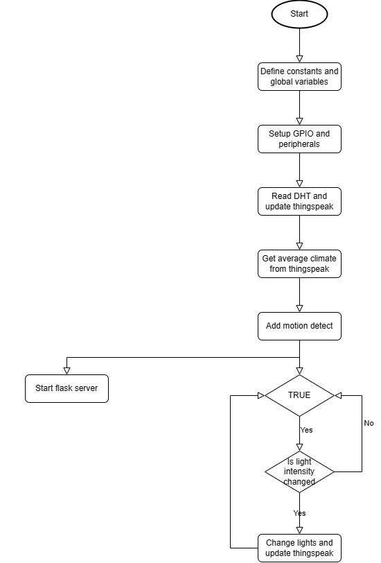

### Interrupt flow
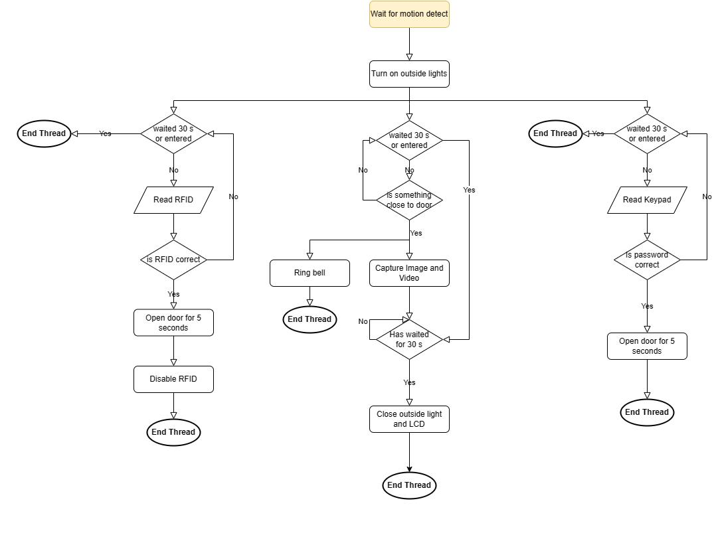

### Flask Server
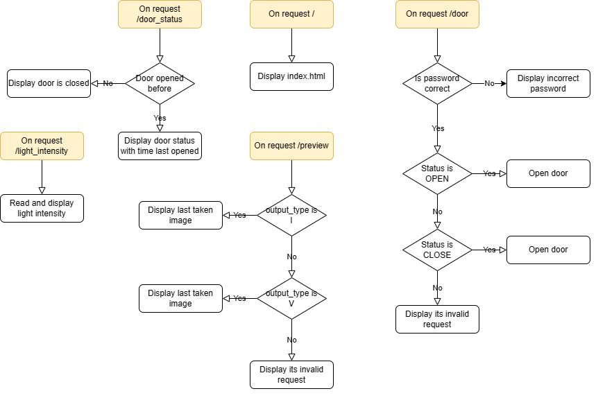

### Hardware Diagram
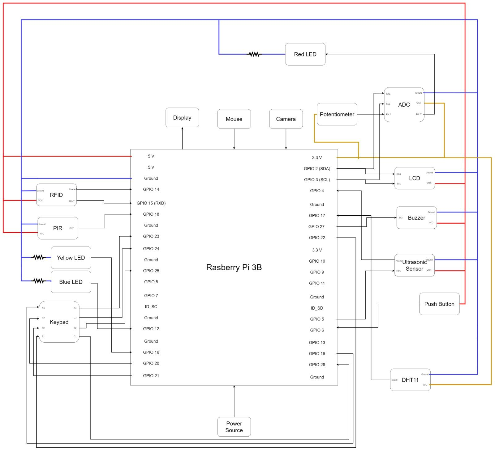

### System
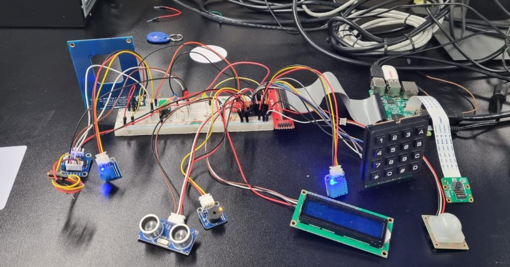

### Full functioning scenario
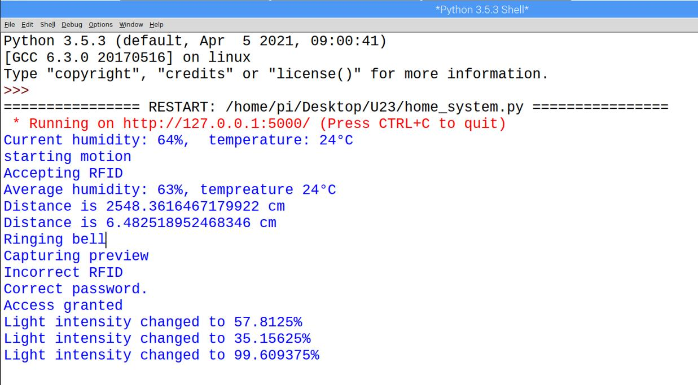
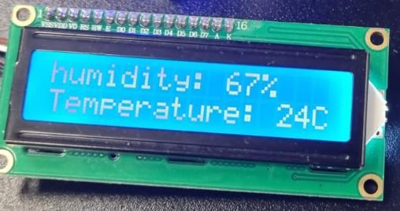

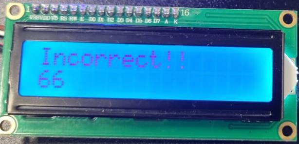
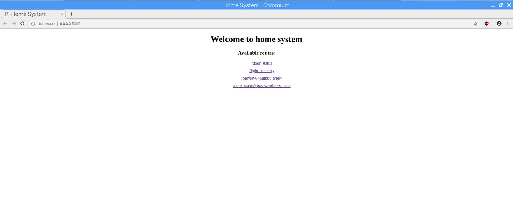

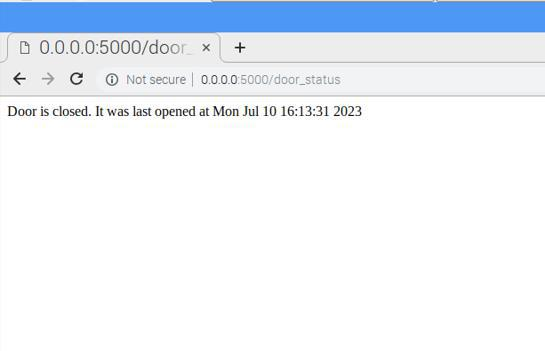
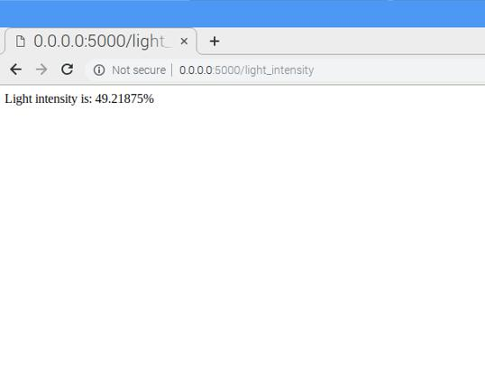

### Dynamic Route (1)
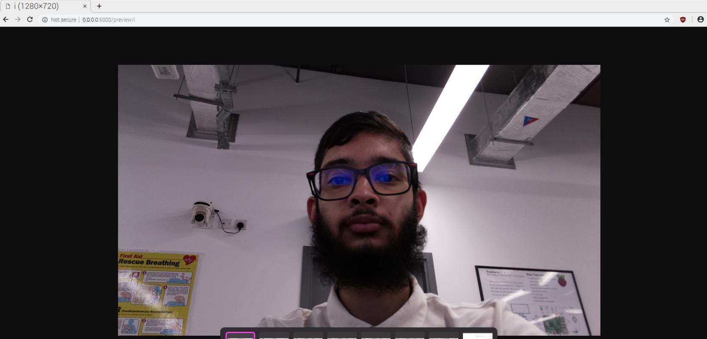
### Dynamic Route (2)
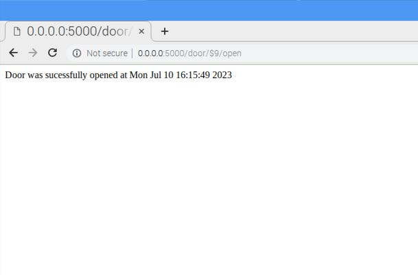

### Thinkspeak screenshot
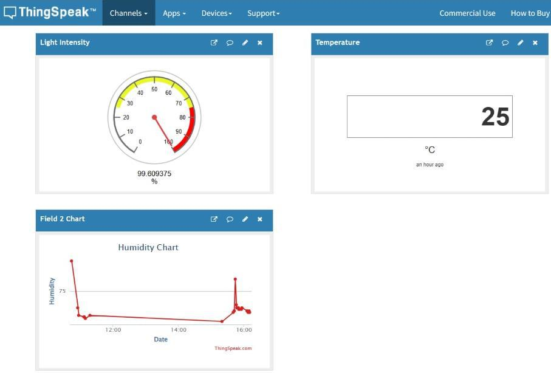

### MTP app screenshot
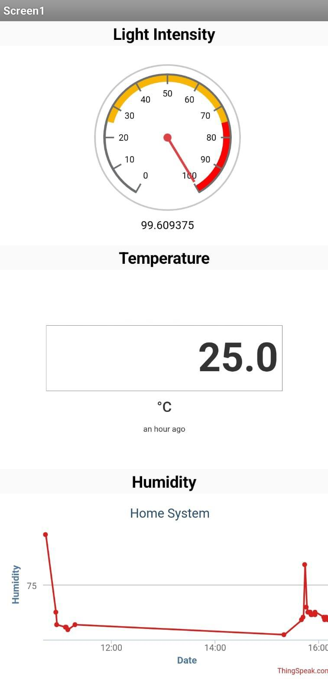

---

## 📄 Full Project Report
Developed by:
1. Hussain Saif
2. Syed Faizan (Me)

For the detailed explanation, methodology, and results, please refer to the full report:  
[Smart Home Automation Project Report](https://syed-raza-portfolio.netlify.app/static/media/smart.18e8e28d85751a617950.pdf)

---

